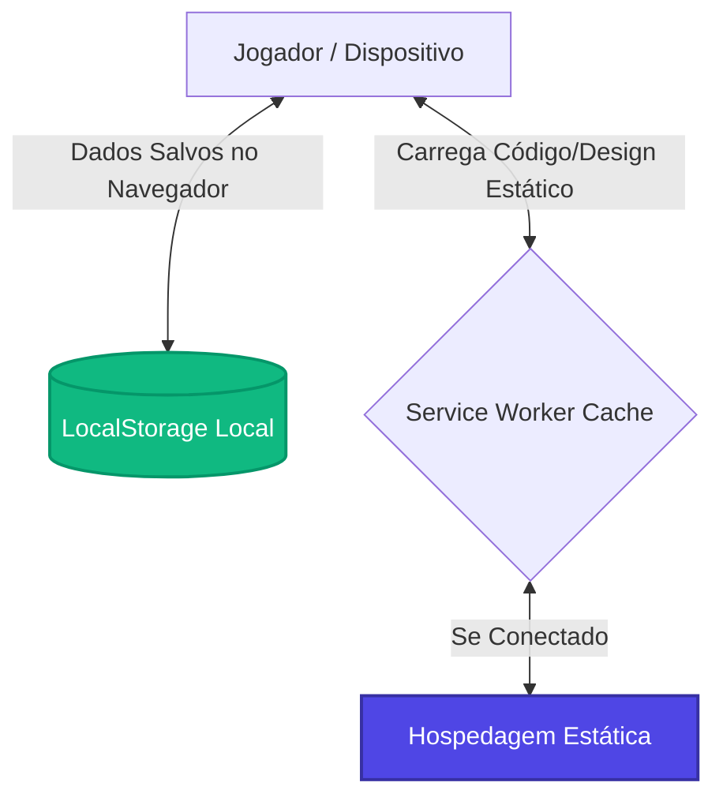

# Guia de Implementação e Segurança PWA: Space Adventure

Este documento descreve como o seu jogo/aplicação PWA (Progressive Web App) foi estruturado e detalha os mecanismos que garantem a **segurança total de dados** e a **privacidade do usuário**, sem a necessidade de APIs externas ou de coletar informações pessoais.

---

## 📂 Estrutura de Arquivos Criada
Criamos os arquivos essenciais na pasta [C:/Users/bruno/pwa-game](file:///C:/Users/bruno/pwa-game):

*   [index.html](file:///C:/Users/bruno/pwa-game/index.html): Estrutura visual da aplicação, com o player de vídeo preparado para rodar em loop e com as tags de manifesto configuradas.
*   [style.css](file:///C:/Users/bruno/pwa-game/style.css): Estilo visual premium (tema escuro, glassmorphism e animações) altamente responsivo para PCs e celulares.
*   [app.js](file:///C:/Users/bruno/pwa-game/app.js): Lógica de funcionamento, controle de progresso do jogo e integração do botão de instalação do PWA.
*   [sw.js](file:///C:/Users/bruno/pwa-game/sw.js): O Service Worker que permite ao aplicativo salvar o código em cache e rodar offline.
*   [manifest.json](file:///C:/Users/bruno/pwa-game/manifest.json): Arquivo que informa ao sistema operacional do smartphone ou PC que o site é um aplicativo instalável.
*   `icon-192.jpg` / `icon-512.jpg`: Ícones gerados para o aplicativo.

---

## 🔒 Segurança por Design (Privacy-First)

Por ser uma aplicação **estática** baseada exclusivamente em HTML, CSS e JavaScript client-side (executado direto no dispositivo do usuário), seu projeto já possui fortes proteções naturais:



### 1. Zero Vazamento de Dados
Não há banco de dados centralizado nem servidores backend próprios. O progresso das fases, cristais e pontuação são salvos usando a **Web Storage API (localStorage)**.
*   Os dados ficam armazenados de forma isolada dentro do sandbox de segurança do navegador do próprio usuário.
*   Nenhum dado pessoal do jogador sai do dispositivo dele.
*   Você não corre o risco de violar legislações como a LGPD (Lei Geral de Proteção de Dados), pois não coleta nenhum dado pessoal.

### 2. Sem Chaves de API no Código
Como o site é estático, qualquer pessoa pode ler seu código JavaScript abrindo o console do desenvolvedor. **O PWA foi programado para não usar nenhuma chave de API ou token de autenticação.** 
*   Todas as transições, salvamentos de dados e desbloqueios de fases ocorrem puramente de forma local e segura no navegador.

### 3. HTTPS Obrigatório (Criptografia de Conexão)
Para funcionar como PWA, os navegadores modernos exigem que o site utilize **HTTPS**.
*   Ao hospedar seu site em serviços confiáveis, a conexão entre o jogador e os arquivos do site é criptografada de ponta a ponta, impedindo que provedores de internet ou hackers na mesma rede Wi-Fi interceptem os arquivos ou injetem códigos maliciosos.

---

## 🚀 Como Testar Localmente no seu Computador

Os navegadores modernos não permitem rodar Service Workers (PWAs) abrindo o arquivo `index.html` diretamente por dois cliques (`file://`). Você precisa servir os arquivos usando um endereço de servidor local (`http://localhost`).

> [!TIP]
> **Forma mais rápida de rodar localmente:**
> 1. Certifique-se de que você tem o **Node.js** instalado.
> 2. Abra o terminal (PowerShell) e execute o seguinte comando:
>    ```powershell
>    npx http-server C:\Users\bruno\pwa-game -p 8080
>    ```
> 3. Abra o navegador e digite: `http://localhost:8080`

---

## 📹 Como Configurar o Seu Vídeo de Fundo

1. Escolha o seu vídeo de fundo no formato `.mp4`.
2. Para que o carregamento seja rápido em smartphones e não gaste todos os dados móveis dos usuários, **otimize o vídeo**:
    *   Mantenha a duração curta (de 5 a 15 segundos em loop).
    *   Comprima o arquivo (tente deixá-lo abaixo de **5MB**).
3. Renomeie o vídeo para `bg-video.mp4` e cole-o na pasta `C:\Users\bruno\pwa-game`.
4. O código no `index.html` e `style.css` já está configurado para ajustá-lo à tela inteira e rodar silenciosamente em loop.

---

## 🌐 Como Hospedar Gratuitamente e de Forma Segura

Quando você estiver pronto para compartilhar o link com outras pessoas, você pode hospedar o projeto de graça em uma destas plataformas líderes que lidam automaticamente com a segurança física do servidor e fornecem HTTPS gratuito:

| Plataforma | Facilidade | Segurança dos Servidores | Como implantar |
| :--- | :--- | :--- | :--- |
| **Vercel** (Recomendada) | ⭐️⭐️⭐️⭐️⭐️ (Máxima) | 🔒 Nível Corporativo (DDoS e SSL inclusos) | Basta criar uma conta gratuita, arrastar e soltar a pasta `pwa-game` no painel web da Vercel. |
| **GitHub Pages** | ⭐️⭐️⭐️⭐️ (Fácil) | 🔒 Nível Corporativo (Mantido pelo GitHub) | Criar um repositório público e ativar o Pages nas configurações do projeto. |
| **Netlify** | ⭐️⭐️⭐️⭐️⭐️ (Máxima) | 🔒 Nível Corporativo | Também suporta arrastar e soltar a pasta direto no navegador. |

Esses serviços não exigem que você forneça dados de cartão de crédito no plano gratuito e fornecem caminhos limpos e isolados para seu aplicativo rodar.
